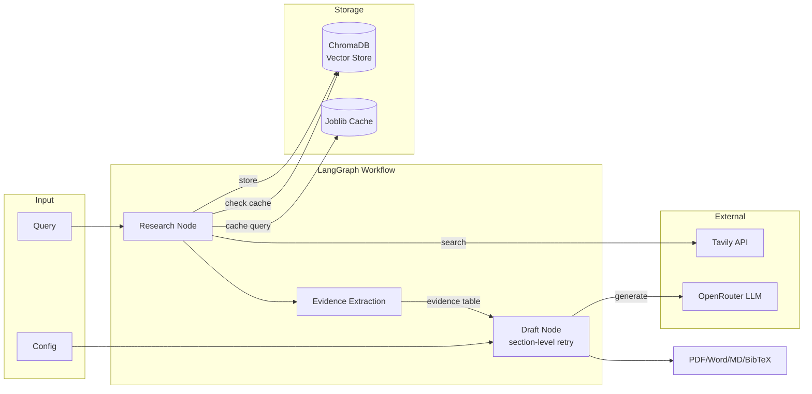

# Deep Research AI Agent

Generate comprehensive research reports on any topic using AI-powered web search and synthesis.

[](LICENSE)
[](https://www.python.org/downloads/)
[](https://streamlit.io)

## Problem

Researching a topic thoroughly is time-consuming. You need to find sources, evaluate credibility, synthesize information, and format citations—all before you even start writing.

## Solution

This tool automates the research workflow:

1. **Search** — Queries Tavily API for relevant sources (filters out social media noise), with parallel variant queries and cross-encoder reranking
2. **Cache** — Stores results in ChromaDB with semantic search and smart TTL
3. **Extract** — Distills raw sources into a structured evidence table that grounds section prompts
4. **Synthesize** — LLM drafts structured reports in your chosen style; only failed sections are retried, not the whole report
5. **Export** — Download as PDF, Word, Markdown, or BibTeX

**[Live Demo →](https://deep-research-ai-agent.streamlit.app/)**

## Architecture



**Key Design Decisions:**

- **Two-node state machine**: Research and Draft are decoupled for testability
- **Vector memory with TTL**: News content expires in 3 days; evergreen in 30 days
- **Cross-encoder reranking**: Improves retrieval precision over raw similarity
- **Evidence table**: Sources are distilled into a structured evidence table that grounds section prompts and inline `[n]` citations (unsupported citations are dropped)
- **Parallel sub-queries**: Deep-research variant queries run concurrently via ThreadPoolExecutor
- **Section-level draft retry**: A validation failure regenerates only the failed section, not the whole report
- **Model fallback chain**: On rate limits or empty responses, drafting moves down `OPENROUTER_FALLBACK_MODELS` and stays there once a fallback works
- **Domain filtering**: Excludes Reddit, Twitter, TikTok by default

## Quick Start

```bash
# Clone
git clone https://github.com/saksham-jain177/AI-Agent-based-Deep-Research.git
cd AI-Agent-based-Deep-Research

# Install
pip install -r requirements.txt

# Configure
cp .env.example .env
# Edit .env with your API keys

# Run
streamlit run app.py
```

**Required API Keys:**

| Key                  | Provider                               | Purpose       |
| -------------------- | -------------------------------------- | ------------- |
| `TAVILY_API_KEY`     | [tavily.com](https://tavily.com)       | Web search    |
| `OPENROUTER_API_KEY` | [openrouter.ai](https://openrouter.ai) | LLM inference |

**Optional:**

```bash
ENABLE_VECTOR_STORE=true       # Enable ChromaDB caching
PREFER_CACHE_RESULTS=false     # Prefer cached over fresh results
LLM_MAX_OUTPUT_TOKENS=4000     # Per-call LLM output token cap (default 4000)
TOKEN_BUDGET_PER_REPORT=12000  # Total prompt-token budget; low-confidence evidence is trimmed to fit
OPENROUTER_FALLBACK_MODELS=    # Comma-separated fallback model chain for rate limits / empty responses
```

## Configuration

| Setting         | Options                               | Default  |
| --------------- | ------------------------------------- | -------- |
| Writing Style   | Academic, Business, Technical, Casual | Academic |
| Citation Format | APA, MLA, IEEE, BibTeX                | APA      |
| Word Count      | 500–5000                              | 1000     |
| Language        | English, Spanish, German              | English  |
| Deep Research   | On/Off                                | Off      |

## Performance

| Metric             | Shallow Mode  | Deep Mode     |
| ------------------ | ------------- | ------------- |
| Sources fetched    | 5             | 20–30         |
| Avg. response time | ~15s          | ~45s          |
| Cache hit speedup  | 20–40% faster | 30–60% faster |
| Token usage        | ~2K–5K        | ~8K–15K       |

_Measured on typical queries with ChromaDB caching enabled._

## Non-Goals

This tool is **not**:

- A fact-verification engine — always verify critical claims
- Real-time streaming — uses section-by-section progress
- A citation authority — check sources before academic submission
- Optimized for legal/medical/financial advice

## Limitations

- **Rate limits**: Tavily free tier has daily limits
- **Model availability**: OpenRouter free models may be rate-limited (a fallback model chain mitigates this)
- **Citation accuracy**: Auto-generated citations should be manually verified; inline `[n]` references are checked against the evidence table, but underlying source quality is not judged
- **Language support**: Best results in English; ES/DE are functional but less tested

## Testing

The test suite (138 tests) runs fully offline — all LLM and Tavily calls are mocked. It covers evidence extraction, citation validation, section-level draft retry, reranking, prompt-injection sanitization, log redaction, token budgets, output-token caps, model fallback, and timeouts.

```bash
pytest tests/ -v
```

## Project Structure

```
├── app.py                # Streamlit UI
├── main.py               # LangGraph workflow orchestration
├── research_agent.py     # Tavily search (parallel variants) + vector store integration
├── evidence_extractor.py # LLM-assisted distillation of sources into an evidence table
├── draft_agent.py        # LLM prompting, section generation, retries, fallback chain, cost controls
├── vector_store.py       # ChromaDB with cross-encoder reranking and TTL
├── sanitize.py           # Prompt-injection neutralization for fetched web content
├── log_redaction.py      # API key redaction from logs and session state
├── cost_estimator.py     # Token/cost estimation with uncertainty
├── citation_formatter.py # APA/MLA/IEEE/BibTeX generation with citation grounding
└── tests/                # Pytest suite: 138 tests, all offline (LLM/Tavily mocked)
```

## Contributing

1. Fork the repository
2. Create a feature branch (`git checkout -b feature/your-idea`)
3. Run tests (`pytest tests/ -v`)
4. Submit a pull request

See [CONTRIBUTING.md](CONTRIBUTING.md) for detailed guidelines.

## License

MIT License — use freely for personal or commercial projects.

---

**Questions?** [Open an issue](https://github.com/saksham-jain177/AI-Agent-based-Deep-Research/issues) or [start a discussion](https://github.com/saksham-jain177/AI-Agent-based-Deep-Research/discussions).
